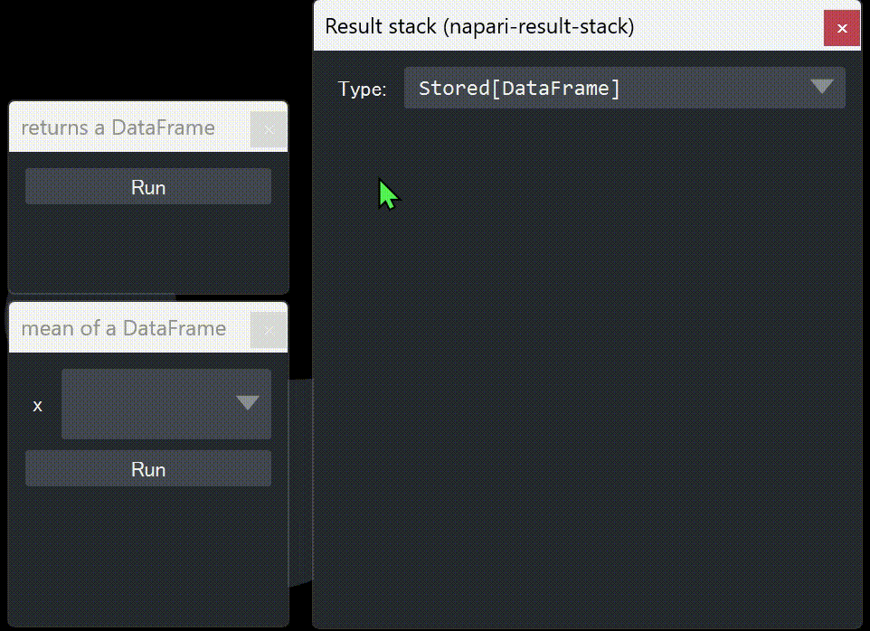

# napari-result-stack

[](https://github.com/hanjinliu/napari-result-stack/raw/main/LICENSE)
[](https://pypi.org/project/napari-result-stack)
[](https://python.org)
[](https://github.com/hanjinliu/napari-result-stack/actions)
[](https://codecov.io/gh/hanjinliu/napari-result-stack)
[](https://napari-hub.org/plugins/napari-result-stack)

Widgets and type annotations for storing function results of any types.

## `Stored` type

Type `Stored[T]` is equivalent to `T` for the type checker, but `magicgui` is aware of this annotation and behaves as a "storage" for the `T` instances.

```python
from pathlib import Path
import pandas as pd
from magicgui import magicgui
from napari_result_stack import Stored

# Returned values will be stored in a result stack.
@magicgui
def provide_data(path: Path) -> Stored[pd.DataFrame]:
    return pd.read_csv(path)

# You can choose one of the values stored in the result stack
# for the argument `df` from a ComboBox widget.
@magicgui
def print_data(df: Stored[pd.DataFrame]):
    print(df)
```

- Different types use different storage. e.g. `Stored[int]` and `Stored[str]` do not share the same place.
- Even for the same type, you can specify the second key to split the storage. e.g. `Stored[int]`, `Stored[int, 0]` and `Stored[int, "my-plugin-name"]` use the distinct storages.

## Manually store variables

`Stored.valuesof[T]` is a `list`-like object that returns a view of the values stored in `Stored[T]`. This value view is useful if you want to store values outside `@magicgui`.

```python
from magicgui.widgets import PushButton
from datetime import datetime
from napari_result_stack import Stored

button = PushButton(text="Click!")

@button.changed.connect
def _record_now():
    Stored.valuesof[datetime].append(datetime.now())

```

## Result stack widget

`napari-result-stack` provides a plugin widget that is helpful to inspect all the stored values.




<details><summary>Show code</summary><div>

```python
from napari_result_stack import Stored
from magicgui import magicgui
import numpy as np
import pandas as pd

@magicgui
def f0() -> Stored[pd.DataFrame]:
    return pd.DataFrame(np.random.random((4, 3)))

@magicgui
def f1(x: Stored[pd.DataFrame]) -> Stored[float]:
    return np.mean(np.array(x))

viewer.window.add_dock_widget(f0, name="returns a DataFrame")
viewer.window.add_dock_widget(f1, name="mean of a DataFrame")
```

---
</div></details>


----------------------------------

This [napari] plugin was generated with [Cookiecutter] using [@napari]'s [cookiecutter-napari-plugin] template.

<!--
Don't miss the full getting started guide to set up your new package:
https://github.com/napari/cookiecutter-napari-plugin#getting-started

and review the napari docs for plugin developers:
https://napari.org/stable/plugins/index.html
-->

## Installation

You can install `napari-result-stack` via [pip]:

    pip install napari-result-stack


To install latest development version :

    pip install git+https://github.com/hanjinliu/napari-result-stack.git


## Contributing

Contributions are very welcome. Tests can be run with [tox], please ensure
the coverage at least stays the same before you submit a pull request.

## License

Distributed under the terms of the [BSD-3] license,
"napari-result-stack" is free and open source software

## Issues

If you encounter any problems, please [file an issue] along with a detailed description.

[napari]: https://github.com/napari/napari
[Cookiecutter]: https://github.com/audreyr/cookiecutter
[@napari]: https://github.com/napari
[MIT]: http://opensource.org/licenses/MIT
[BSD-3]: http://opensource.org/licenses/BSD-3-Clause
[GNU GPL v3.0]: http://www.gnu.org/licenses/gpl-3.0.txt
[GNU LGPL v3.0]: http://www.gnu.org/licenses/lgpl-3.0.txt
[Apache Software License 2.0]: http://www.apache.org/licenses/LICENSE-2.0
[Mozilla Public License 2.0]: https://www.mozilla.org/media/MPL/2.0/index.txt
[cookiecutter-napari-plugin]: https://github.com/napari/cookiecutter-napari-plugin

[file an issue]: https://github.com/hanjinliu/napari-result-stack/issues

[napari]: https://github.com/napari/napari
[tox]: https://tox.readthedocs.io/en/latest/
[pip]: https://pypi.org/project/pip/
[PyPI]: https://pypi.org/
